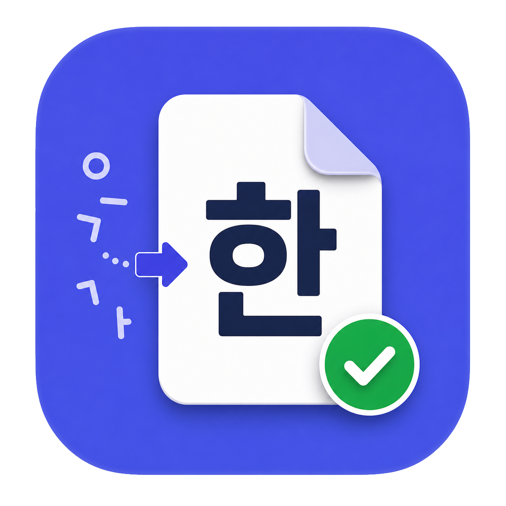
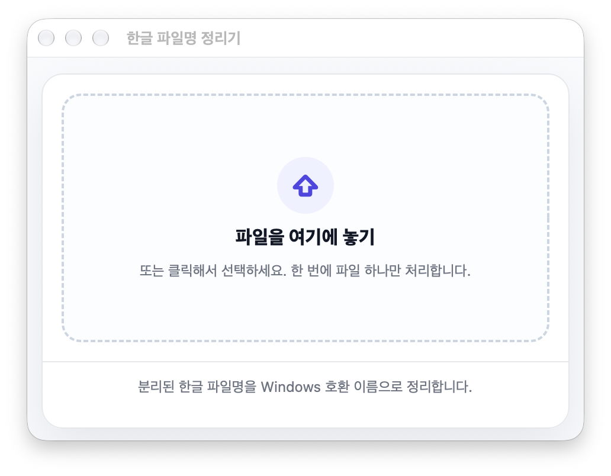
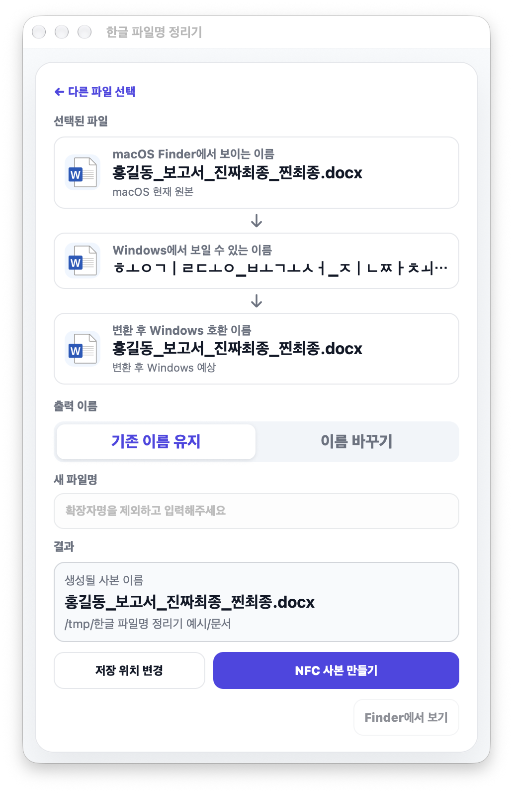
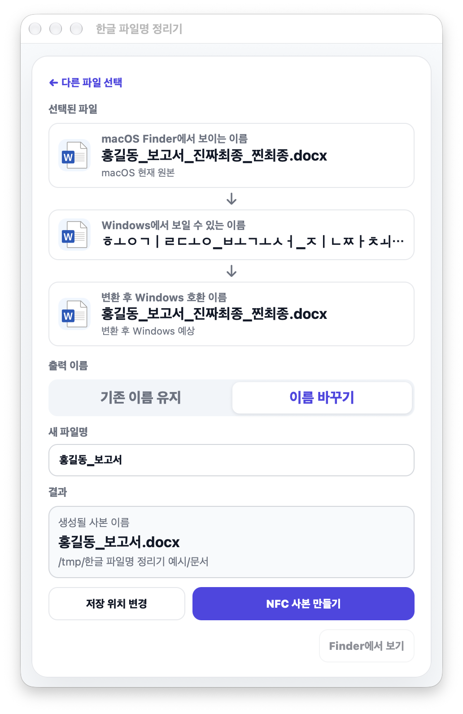
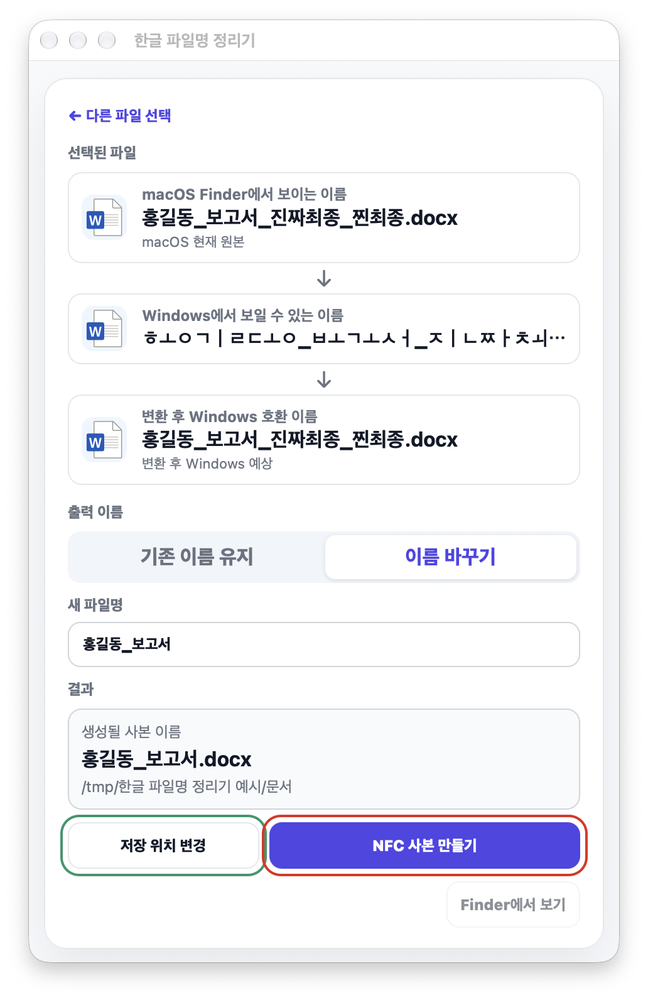
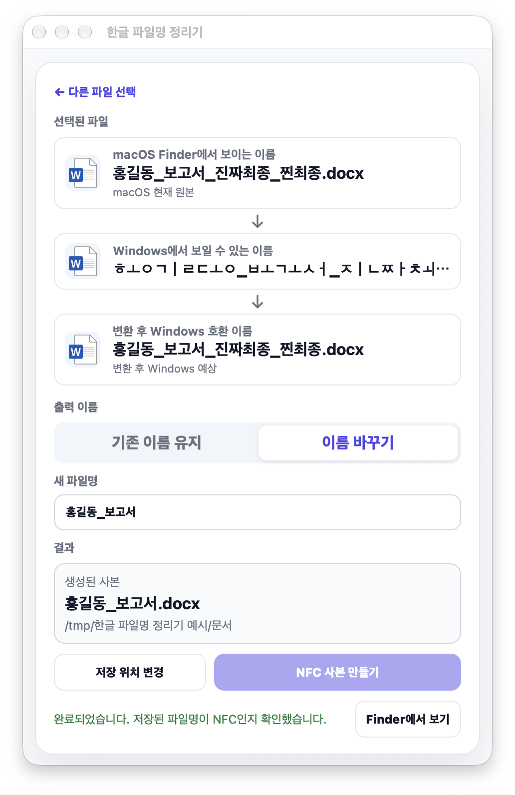

# Hangeul Filename Fixer

[](https://github.com/hyunseop827/hangeul-filename-fixer/actions/workflows/ci.yml)

> [!WARNING]
> This is a personal tool under validation. It normalizes Korean filenames on macOS to NFC, but it cannot guarantee correct display across every mail or upload flow. See [Email Attachment Notes](#email-attachment-notes).

This is the short English README. The Korean README is available here: [README.md](README.md)

<p align="center">
  
</p>

A small macOS app that creates NFC-normalized copies of files with Korean filenames.

On macOS, a filename may look normal:

```text
홍길동_레포트_진짜최종_찐최종.hwp
```

But on Windows or some upload flows, it can appear decomposed:

```text
ㅎㅗㅇㄱㅣㄹㄷㅗㅇ_ㄹㅔㅍㅗㅌㅡ_ㅈㅣㄴㅉㅏㅊㅚㅈㅗㅇ_ㅉㅣㄴㅊㅚㅈㅗㅇ.hwp
```

This app normalizes the filename and creates a new copy.
The original file is never modified.

## Download and First Launch

**[Download the latest DMG](https://github.com/hyunseop827/hangeul-filename-fixer/releases/latest/download/hangeul-filename-fixer.dmg)**

Versioned files and release notes are on [GitHub Releases](https://github.com/hyunseop827/hangeul-filename-fixer/releases).
The DMG file is distributed through GitHub Releases, not committed directly to the repository.

**Requirements:** macOS 12 Monterey or later. It is a universal app for both Apple Silicon (M1 or later) and Intel Macs, and the DMG is about 3 MB. The app UI and menus are in Korean.
Before the in-app updater was added, 2.0.0 was used by hand on one Apple Silicon Mac with macOS 27, and the automated checks (CI, macOS 26) started it as an Apple Silicon app and as an Intel app (under Rosetta). The 2.0.0 build that includes the updater has not been run yet. It has also not been run on a real Intel Mac or on macOS 12 to 25 yet.

This is a personal ad-hoc signed build and is not notarized by Apple.
Because of that, macOS may show a warning saying Apple cannot verify that the app is free from malware.
This warning means the app has not been notarized by Apple. It does not mean Apple found malware.

### Opening it the first time

In the DMG, the app appears as `한글 파일명 정리기.app`. Open the DMG and move the app to Applications first.

**macOS 15 Sequoia and later**

1. Open the app once. When the warning appears, click `Done`.
2. Go to `System Settings` → `Privacy & Security`, scroll down to `Security`, and click `Open Anyway`.
3. Confirm with your password or Touch ID. The app opens normally from then on.

**macOS 12 Monterey to 14 Sonoma**

Control-click (right-click) the app in Finder, choose `Open`, then click `Open` again in the warning.
(Button and settings names differ slightly between versions. On macOS 12 you can also allow it under `System Preferences` → `Security & Privacy` → `General`.)

If it still does not open, paste this into Terminal:

```bash
xattr -dr com.apple.quarantine "/Applications/한글 파일명 정리기.app"
open "/Applications/한글 파일명 정리기.app"
```

This only removes the macOS quarantine flag from the downloaded app. Run it only if you trust the source code and the release file.

### Updating

From 2.0.0 on, the app updates from inside the app. You do not need to download a new DMG.

- Choose `한글 파일명 정리기` → `업데이트 확인…` (Check for Updates…) in the menu bar to check right away. While it is running, the app also checks once a day on its own.
- When there is a newer version, it shows what changed and asks. Only when you choose `업데이트 설치` (Install Update) does it download the new version, verify its signature, replace the app and reopen it. It never installs without asking.
- Keep the app in Applications. An app opened inside the DMG, or from where it was downloaded, cannot update itself.
- **If you use 1.x (up to 1.1.0)**, the app has no updater. Download the 2.0.0 DMG and replace the app in Applications by hand once; after that, update from the app.

2.0.0 is the first version with the updater, so the first real update will be the one to the next version.

### Privacy

- No accounts and no usage tracking.
- The only thing the app uses the internet for is the update check. Once a day while it is running, and when you choose `업데이트 확인…`, it reads the latest release's list of updates (`appcast.xml`) from GitHub. Nothing about your files, such as their names or contents, is sent.
- The new version (a DMG) is downloaded from GitHub only when you choose to install it, and it is checked against the signing key (EdDSA) inside the app before it is opened. Updates are handled by [Sparkle](https://sparkle-project.org).
- Sparkle keeps a little state in the app's preferences (when it last checked, a skipped version, window positions).

## How It Works

1. Drop or select one file.
2. Check the current macOS filename.
3. Preview how it may appear on Windows.
4. Keep the Korean name as NFC or enter a custom name.
5. Create a single NFC-normalized copy and attach that copy when sharing the file.

If you keep the original name and it is already NFC and Windows-safe, the app tells you that no copy is needed.

## Email Attachment Notes

In local tests, generated NFC copies displayed correctly on Windows through **Naver Mail**, **Daum Mail**, and **Safari + Gmail**.

However, **Chrome + Gmail web attachments** may still put a decomposed Korean filename into the Gmail raw message. This appears to be a Chrome/Gmail web attachment normalization issue, not a problem with the generated file itself.

| Attachment path | Windows result | Note |
| --- | --- | --- |
| Chrome + Gmail web attachment | Broken | Gmail raw message contains a decomposed Korean attachment filename |
| Safari + Gmail web attachment | OK | Gmail raw message contains an NFC Korean attachment filename |
| Chrome + Naver Mail | OK | Verified in testing |
| Chrome + Daum Mail | OK | Verified in testing |

If you need to keep Korean filenames in Gmail, attach the file from **Safari** instead of Chrome.

## Screenshots

### Select a File

<p align="left">
  
</p>

The window fits its content. It gets taller once a file is selected, and only its width can be resized.

### Choose the Output Name

<table>
  <tr>
    <th width="50%">Keep Original Name</th>
    <th width="50%">Rename</th>
  </tr>
  <tr>
    <td width="50%">Keep the Korean name and normalize it to NFC.</td>
    <td width="50%">Enter a new base name. The original extension is kept; typing it as well does not add it twice.</td>
  </tr>
  <tr>
    <td width="50%" valign="top">
      
    </td>
    <td width="50%" valign="top">
      
    </td>
  </tr>
</table>

### Create the Copy

<p align="left">
  
</p>

When sharing the file, attach the generated copy.
The app reads the created file back and verifies that the stored filename is NFC-normalized.

> [!NOTE]
> **Keeping the original name and saving next to the original adds ` (1)` before the extension** (e.g. `report (1).hwp`). macOS treats the decomposed (NFD) and NFC spellings as the same name, so a second file with that name cannot sit next to the original. To keep the exact name, choose another folder (for example the Desktop) with `저장 위치 변경`. The app shows this hint as well.

> [!IMPORTANT]
> **Copies with Korean names cannot be saved to USB sticks or external drives formatted exFAT, FAT32 or Mac OS Extended.** macOS reports filenames on those drives in decomposed form, so the app removes the copy and explains why (ASCII-only names are saved normally). Create the copy on the internal disk, then attach or upload it.

When using Gmail with Korean filenames, attach the file from Safari rather than Chrome.

### Result

<p align="left">
  
</p>

## Naming Rules

- Normalize the name, including the extension, to NFC.
- Replace characters Windows does not allow (`< > : " / \ | ? *`) and control characters with `_`.
- Trim leading and trailing spaces and a trailing dot.
- Prefix Windows reserved names such as `CON`, `NUL`, `COM1` or `LPT1` with `_`, even with an extension (`con.tar.gz`).
- Add ` (1)`, ` (2)` when the name is taken. Existing files are never overwritten.
- Keep the download quarantine flag on the copy, so Gatekeeper still checks downloaded apps and scripts.

## Supported Files

Most regular files are supported:

- PDF
- DOCX, PPTX
- HWP
- TXT
- Images
- ZIP
- IPYNB
- Files without extensions

Folders, `.app` bundles, and documents saved as macOS packages (for example package-format `.pages` or `.key`) are not supported yet.

## Development

Requirements: macOS with Xcode 26 or later (Swift 6.2 or later). The app is a Swift package without an Xcode project. Its only external library is [Sparkle](https://github.com/sparkle-project/Sparkle) 2.10.0, for updates, which Swift Package Manager downloads on the first build. A release build and the DMG need Xcode itself; the Command Line Tools alone cannot build the Intel half. Node.js is only used to run `scripts/release-plan.mjs` (no packages to install; it needs `gh`).

| Command | Purpose | Description |
| --- | --- | --- |
| `./scripts/test.sh` | Run tests | Unit tests for the naming rules, the copy and verification logic, the screen state, the window and the update settings. Briefly creates two small HFS+ and exFAT disk images and removes them again. |
| `./scripts/build-app.sh` | Build the app | Builds `build/한글 파일명 정리기.app`, a debug build for this Mac's architecture, embeds Sparkle and ad-hoc signs it. Run it with `open "build/한글 파일명 정리기.app"`. |
| `./scripts/build-app.sh release` | Release build | Builds a universal (Apple Silicon + Intel) app in the same place. |
| `./scripts/make-dmg.sh` | Create DMG | Builds a release app in `build/release/`, then creates `build/hangeul-filename-fixer-<version>.dmg` and its `.dmg.sha256`, and opens the image again to check the version and signature. |
| `scripts/verify-dmg.sh <dmg> <version>` | Check DMG | Checks the version, signature, architectures (arm64 + x86_64) and minimum macOS of the app in the DMG, and Sparkle and the update settings. |
| `node scripts/release-plan.mjs --check` | Check release | Shows what CI would do with the current version and release notes. Publishes nothing. |

The filename rules are in [Sources/HangeulFilenameFixerCore/Naming.swift](Sources/HangeulFilenameFixerCore/Naming.swift), and copying and verification in [Sources/HangeulFilenameFixerCore/FileCopy.swift](Sources/HangeulFilenameFixerCore/FileCopy.swift). The app itself (AppKit + SwiftUI) is under `Sources/HangeulFilenameFixer/`; `AppUpdater.swift` there is the update check and the app's only network code. Two scripts are used only by the release: `scripts/make-appcast.sh` signs the DMG and writes the update feed (`appcast.xml`), and `scripts/ed25519-verify.swift` checks that signature against the app's public key. `scripts/check-release-tools.sh` runs both without a signing key, on every pull request.

Only the repository owner creates and keeps the key that signs updates. The public key is in `Resources/Info.plist`. If a placeholder (`PASTE_PUBLIC_KEY_FROM_generate_keys`) stands there instead of a real key, one test fails on purpose and an app built that way does not check for updates (its `업데이트 확인…` menu item is disabled). See "In-app updates with Sparkle" in [AGENTS.md](AGENTS.md).

Contributor and AI-agent notes are in [AGENTS.md](AGENTS.md). Architecture notes are in [docs/ARCHITECTURE.md](docs/ARCHITECTURE.md) (Korean).

When a new version reaches `main`, GitHub Actions tests it, builds the DMG, signs it for the updater and publishes it with release notes and the update feed (`appcast.xml`) on [GitHub Releases](https://github.com/hyunseop827/hangeul-filename-fixer/releases); installed copies learn about the new version from that feed. The app version is the `CFBundleShortVersionString` in `Resources/Info.plist`. The `CI` workflow also runs the tests and builds and checks the DMG for every pull request.

## Built with AI

This app is developed with AI coding agents under the direction of its owner, Hyunseop Kim. The tools used so far are OpenAI Codex (v1.0.0) and Claude Code (Claude Opus 5.5 and Claude Fable 5.1). The owner defines the problem, tests real mail and upload flows, and makes the final decisions, including releases; the agents follow [AGENTS.md](AGENTS.md) for implementation, tests, and documentation. How AI was used and how its results were checked is in [docs/AI_DEVELOPMENT.md](docs/AI_DEVELOPMENT.md) (Korean).

## Installation Notes

The current DMG is a personal ad-hoc signed build.
Because it is not notarized by Apple, macOS Gatekeeper may show a warning on first launch.
To remove this warning completely, the app needs to be signed with an Apple Developer ID and notarized by Apple.

## License

Non-commercial license.

- Anyone may use it free of charge, including at school or at work.
- You may modify and share it free of charge; keep the license and copyright notice.
- Commercial use, such as selling it, charging for it, or putting it in a paid product or service, needs permission.

See [LICENSE](LICENSE).

The app includes the open-source library [Sparkle](https://github.com/sparkle-project/Sparkle) (MIT license) for updates. The license notices of Sparkle and of the code it includes are in [Resources/ThirdPartyNotices.txt](Resources/ThirdPartyNotices.txt), and the same file is inside the app bundle.

## Version History

See [GitHub Releases](https://github.com/hyunseop827/hangeul-filename-fixer/releases).
