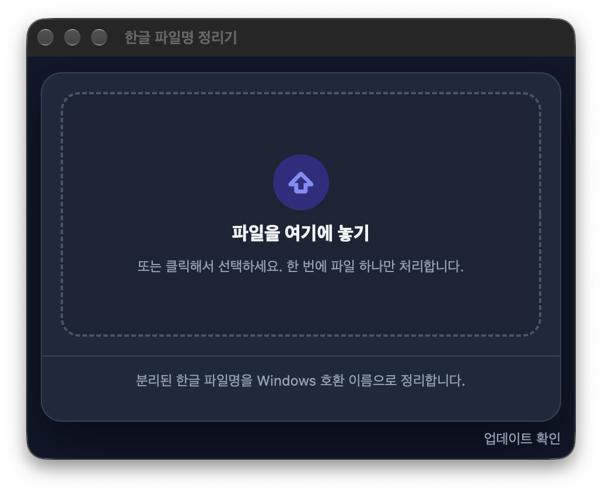

# Hangeul Filename Fixer / 한글 파일명 정리기

[](https://github.com/hyunseop827/hangeul-filename-fixer/actions/workflows/ci.yml)

> [!WARNING]
> 아직 여러 환경에서 테스트 중인 개인용 도구입니다. 한글 파일명을 Windows에서 덜 깨지게 정리하지만, **모든 메일/제출 사이트에서 100% 정상 표시를 보장하진 않습니다.**
> 자세한 테스트 결과는 [메일 첨부 주의](#메일-첨부-주의)에 정리해뒀습니다.

This app is mainly for Korean users. A short English README is available here: [README.en.md](README.en.md)

---

<p align="center">
  
</p>

내 맥북 macOS에서는 이렇게 보여도 `홍길동_레포트_진짜최종_찐최종.hwp`

Windows 컴퓨터나 학교 교수님한테는 이렇게 깨져 보일 수 있습니다.

`ㅎㅗㅇㄱㅣㄹㄷㅗㅇ_ㄹㅔㅍㅗㅌㅡ_ㅈㅣㄴㅉㅏㅊㅚㅈㅗㅇ_ㅉㅣㄴㅊㅚㅈㅗㅇ.hwp`

이 앱은 그런 파일명을 Windows에서도 덜 깨지게 정리해서 **새 복사본**으로 만들어줍니다.

**원본 파일은 건드리지 않습니다.**

## 다운로드 및 처음 실행

**[최신 버전 DMG 바로 받기](https://github.com/hyunseop827/hangeul-filename-fixer/releases/latest/download/hangeul-filename-fixer.dmg)**

버전별 파일과 릴리스 노트는 [GitHub Releases](https://github.com/hyunseop827/hangeul-filename-fixer/releases)에 있습니다. 소스 코드는 이 저장소에 있습니다.

**요구 사항:** macOS 12 Monterey 이상. Apple Silicon(M1 이상)과 Intel Mac을 모두 지원하는 유니버설 앱이고, DMG는 약 3MB입니다. 앱 화면과 메뉴는 한국어입니다.<br>
업데이트 기능을 넣기 전의 2.0.0은 macOS 27을 쓰는 Apple Silicon Mac 한 대에서 직접 써 봤고, 업데이트 기능이 들어간 2.0.0 빌드는 자동 검사(CI, macOS 26)에서 Apple Silicon용과 Intel용(Rosetta)으로 켜지는 것을 확인했습니다. 설치된 2.0.0이 앱 안에서 2.0.1로 업데이트되는 것은 2026-10-09에 Apple Silicon Mac(macOS 27)에서 확인했습니다. 실제 Intel Mac과 macOS 12 ~ 25에서는 아직 실행해 보지 못했습니다.

현재 DMG는 개인이 배포하는 거라서 Apple의 공증을 받지 못했습니다.<br>
처음 실행할 때 macOS가 `Apple이 악성 코드가 없음을 확인할 수 없습니다`라는 경고를 띄울 수 있습니다.<br>
이 경고는 Apple 공증을 받지 않았다는 뜻이지, Apple이 악성코드를 발견했다는 뜻은 아닙니다.

### 처음 여는 방법

DMG 안에서는 앱이 `한글 파일명 정리기.app` 이름으로 보입니다. 먼저 DMG를 열고 `한글 파일명 정리기.app`을 `응용 프로그램` 폴더로 옮깁니다.

**macOS 15 Sequoia 이상**

1. 앱을 한 번 실행합니다. 경고창이 뜨면 `완료`를 눌러 닫습니다.
2. `시스템 설정` → `개인정보 보호 및 보안`으로 가서 아래쪽 `보안` 항목의 `그래도 열기`를 누릅니다.
3. 암호나 Touch ID로 확인하면 이후에는 그냥 열립니다.

**macOS 12 Monterey ~ 14 Sonoma**

Finder에서 앱을 우클릭(Control-클릭)하고 `열기`를 누른 뒤, 경고창에서 다시 `열기`를 누릅니다.<br>
(경고창 버튼과 설정 화면 이름은 버전마다 조금 다릅니다. macOS 12에서는 `시스템 환경설정` → `보안 및 개인 정보 보호` → `일반`에서도 허용할 수 있습니다.)

그래도 안 열리면 터미널에 아래 명령어를 그대로 붙여넣으세요.

```bash
xattr -dr com.apple.quarantine "/Applications/한글 파일명 정리기.app"
open "/Applications/한글 파일명 정리기.app"
```

이 명령어는 다운로드된 앱에 붙은 macOS 격리 표시만 제거합니다. 소스 코드나 배포 파일을 신뢰할 수 있을 때만 실행하세요.

### 업데이트

2.0.0부터는 앱 안에서 업데이트할 수 있습니다. 새 DMG를 직접 받지 않아도 됩니다.

- 메뉴 막대의 `한글 파일명 정리기` → `업데이트 확인…`을 누르거나, 창 아래의 `업데이트 확인` 링크(2.0.2부터)를 누르면 바로 확인합니다. 링크에 마우스를 올리면 지금 쓰는 버전이 보입니다. 앱이 켜져 있는 동안에는 하루에 한 번 앱이 스스로 확인하기도 합니다.
- 새 버전이 있으면 바뀐 점을 보여주고 설치할지 물어봅니다. `업데이트 설치`를 골라야만 새 버전을 내려받고, 받은 파일의 서명을 확인한 뒤 앱을 바꾸고 다시 엽니다. 묻지 않고 설치하지 않습니다.
- 앱은 꼭 `응용 프로그램` 폴더로 옮겨서 쓰세요. DMG 안에서 바로 열었거나 내려받은 자리에서 그대로 연 앱은 스스로 업데이트하지 못합니다.
- **1.x(1.1.0까지)를 쓰고 있다면** 앱 안에 이 기능이 없습니다. 최신 DMG를 받아 `응용 프로그램` 폴더의 앱을 한 번만 직접 바꿔 주세요. 그 뒤로는 앱에서 업데이트하면 됩니다.

2.0.0이 업데이트 기능이 들어간 첫 버전이라 2.0.0에서 2.0.1로 올라가는 것이 첫 실제 업데이트였고, 2026-10-09에 Apple Silicon Mac(macOS 27)에서 확인했습니다.

### 개인정보

- 계정이 없고 사용 기록을 모으지 않습니다.
- 앱이 인터넷에 연결하는 것은 업데이트 확인뿐입니다. 앱이 켜져 있는 동안 하루에 한 번, 그리고 `업데이트 확인…`을 누를 때 GitHub에서 최신 릴리스의 업데이트 목록(`appcast.xml`)을 읽습니다. 파일 이름이나 내용처럼 사용자의 파일에 대한 정보는 보내지 않습니다.
- 새 버전 파일(DMG)은 설치를 고를 때만 GitHub에서 내려받습니다. 받은 파일은 열기 전에 앱에 들어 있는 서명 키(EdDSA)로 확인합니다. 업데이트에는 [Sparkle](https://sparkle-project.org)을 씁니다.
- Sparkle은 앱의 환경설정에 약간의 상태를 저장합니다(마지막으로 확인한 때, 건너뛴 버전, 창 위치).

## 그래서 이게 뭐 하는 프로그램인데요?

쉽게 말하면 파일 이름이 분리되는 문제를 줄여줘요. 그리고 사용법도 진짜 직관적이고요!

1. 파일 하나를 넣습니다.
2. 지금 macOS에서 보이는 이름을 확인합니다.
3. Windows에서 어떻게 보일지 미리 봅니다.
4. 기본은 한글을 유지한 NFC 사본을 만듭니다.

원본은 그대로 두고, 이름만 정리한 사본을 새로 만듭니다. 맥북으로 과제 제출해야 하는 경우 쓰면 좋겠죠?

`기존 이름 유지` 상태에서 이름이 이미 NFC이고 Windows 규칙(금지 문자, 예약 이름, 끝 마침표)에도 맞으면 앱이 `이미 Windows 호환 이름`이라고 알려줍니다. 이때는 사본을 만들 필요가 없어요.

## 메일 첨부 주의

현재 테스트에서는 **Naver 메일**, **Daum 메일**, **Safari + Gmail** 조합에서 Windows 파일명이 정상 표시되었습니다.

다만 **Chrome + Gmail 웹 첨부**에서는 Gmail 원본 메일의 파일명 자체가 다시 분리형 한글로 들어가는 경우가 있었습니다. 확인 결과 앱이 만든 사본이 틀린 것이 아니라, Chrome과 Gmail 웹 첨부 조합에서 생기는 Chromium 계열 정규화 문제에 가깝습니다.

| 첨부 방식 | Windows 표시 결과 | 비고 |
| --- | --- | --- |
| Chrome + Gmail 웹 첨부 | 깨짐 | Gmail 원본 메일의 첨부 파일명 자체가 분리형 한글로 들어감 |
| Safari + Gmail 웹 첨부 | 정상 | Gmail 원본 메일의 첨부 파일명이 NFC 한글로 들어감 |
| Chrome + Naver 메일 | 정상 | 테스트에서 정상 확인 |
| Chrome + Daum 메일 | 정상 | 테스트에서 정상 확인 |

Gmail로 한글 파일명을 유지해서 보내야 한다면 **Chrome 대신 Safari에서 첨부하는 것을 권장합니다.**

## 사용법 (진짜 쉬움)

### 파일 선택 - 파일 하나를 드래그 / 클릭으로 선택합니다.

<p align="left">
  
</p>

창 크기는 화면 내용에 맞춰집니다. 파일을 선택하면 그만큼 창이 길어지고, 폭만 직접 조절할 수 있습니다.<br>
화면은 macOS의 라이트/다크 모드를 따릅니다(2.1.0부터). 아래는 같은 첫 화면의 다크 모드이고, 이 문서의 나머지 스크린샷은 라이트 모드입니다.

<p align="left">
  
</p>

### 이름 선택 - 기존 이름을 유지하거나 새 이름을 입력합니다.

<table>
  <tr>
    <th width="50%">기존 이름 유지</th>
    <th width="50%">이름 바꾸기</th>
  </tr>
  <tr>
    <td width="50%">한글 이름을 유지하면서 NFC로 정리합니다. 보통은 이걸 쓰면 됩니다.</td>
    <td width="50%">파일명 자체도 바꾸고 싶을 때 씁니다. 확장자는 원본 파일에서 그대로 가져오니 이름만 입력하세요. 확장자까지 입력해도 한 번만 붙습니다.</td>
  </tr>
  <tr>
    <td width="50%" valign="top">
      
    </td>
    <td width="50%" valign="top">
      
    </td>
  </tr>
</table>

이 문서의 스크린샷은 저장 위치를 `문서` 폴더로 바꾼 상태라 사본 이름에 ` (1)`이 붙지 않았습니다.

### 사본 만들기 - 저장 위치와 결과 이름을 확인한 뒤 버튼을 누릅니다.

저장 위치는 기본으로 원본 파일이 있던 폴더로 잡힙니다.<br>
초록색 박스의 `저장 위치 변경`으로 바꿀 수 있고, 빨간색 박스의 `NFC 사본 만들기` 버튼을 누르면 끝입니다.<br>
메일이나 제출 시스템에는 생성된 사본을 첨부하세요.

<p align="left">
  
</p>

> [!NOTE]
> **`기존 이름 유지`로 원본과 같은 폴더에 저장하면 확장자 앞에 ` (1)`이 붙습니다** (예: `보고서 (1).hwp`).
> macOS는 분리형(NFD) 이름과 NFC 이름을 같은 이름으로 취급해서, 원본 옆에 같은 이름의 파일을 하나 더 만들 수 없기 때문입니다.
> 원래 이름 그대로 받으려면 `저장 위치 변경`으로 다른 폴더(예: 바탕화면)를 고르세요. 앱도 결과 칸 아래에 이 안내를 보여줍니다.

> [!IMPORTANT]
> **USB 메모리나 외장 드라이브(exFAT, FAT32, Mac OS 확장 형식)에는 한글 이름의 사본을 만들 수 없습니다.**
> macOS가 이런 드라이브의 파일명을 분리형으로 돌려주기 때문에, 앱이 확인 단계에서 사본을 지우고 안내 메시지를 보여줍니다. (영문·숫자만 있는 이름은 그대로 저장됩니다.)
> 내장 디스크의 폴더에 사본을 만든 뒤 메일이나 제출 사이트에 첨부하세요.

Gmail로 보낼 때는 Chrome보다 Safari에서 첨부하는 것을 권장합니다.

### 결과 확인 - 완료되면 `Finder에서 보기`로 생성된 파일을 바로 확인할 수 있습니다.

앱은 사본을 만든 뒤 실제 저장된 파일명이 NFC인지 다시 확인합니다.

<p align="left">
  
</p>

## 지원하는 파일

대부분의 일반 파일을 처리할 수 있습니다.

- PDF
- DOCX, PPTX
- HWP
- TXT
- 이미지
- ZIP
- IPYNB
- 확장자가 없는 파일

HWP도 파일 내용은 그대로 복사하고 사본의 이름만 바꾸므로 일반 파일처럼 처리됩니다.<br>
인터넷에서 받은 파일의 보안 표시(quarantine)는 사본에도 그대로 남습니다. Finder 태그 같은 부가 정보는 사본에 복사되지 않습니다.

아직 지원하지 않는 것:

- 폴더
- `.app`
- 패키지(폴더) 형식으로 저장된 문서 (예: 패키지 형식의 `.pages`, `.key`. 단일 파일로 저장된 문서는 처리됩니다)

이런 항목을 넣으면 앱이 `일반 파일이 아니거나(폴더·앱 등) 더 이상 없습니다`라고 알려줍니다.

## 프로그램 동작 설명 (안 보셔도 돼요!!)

### 전체 흐름

앱은 파일 내용을 열거나 수정하지 않습니다.<br>
선택한 파일의 **파일명만 정리한 뒤**, 사용자가 고른 저장 위치에 **새 사본**을 만듭니다.

대략 흐름은 이렇습니다.

1. 사용자가 파일 하나를 드래그하거나 선택합니다.
2. 앱이 파일 경로를 받은 뒤, 폴더를 다시 읽어 디스크에 실제로 저장된 파일명을 확인합니다. 드래그하거나 선택 창에서 고른 경로는 실제로 저장된 이름과 다른 형태(NFC/분리형)로 들어올 수 있기 때문입니다.
3. 화면에서 현재 이름, Windows에서 깨져 보일 수 있는 이름, 변환 후 이름을 보여줍니다.
4. 사용자가 `기존 이름 유지` 또는 `이름 바꾸기`를 고릅니다.
5. `NFC 사본 만들기`를 누르면 앱이 원본 파일을 복사합니다. 같은 이름의 파일은 절대 덮어쓰지 않습니다.
6. 원본에 인터넷 다운로드 보안 표시(quarantine)가 있으면 사본에도 붙입니다.
7. 앱이 생성된 사본의 실제 파일명을 다시 읽어서 NFC인지 확인합니다. NFC가 아니면 사본을 지우고 이유를 알려줍니다.
8. 원본 파일은 그대로 두고, NFC 이름이 적용된 사본만 남습니다.

### 파일명 정리 기준

규칙은 [Sources/HangeulFilenameFixerCore/Naming.swift](Sources/HangeulFilenameFixerCore/Naming.swift), 복사와 확인은 [Sources/HangeulFilenameFixerCore/FileCopy.swift](Sources/HangeulFilenameFixerCore/FileCopy.swift)에 있습니다.

현재 프로그램은 파일명을 이렇게 정리합니다.

- 한글 파일명을 NFC로 정규화 (확장자 포함)
- Windows에서 쓸 수 없는 문자와 제어 문자를 `_`로 치환 (확장자 포함)
  - `< > : " / \ | ? *`
- 앞뒤 공백과 끝 마침표 정리 (`보고서.` → `보고서`)
- `CON`, `PRN`, `AUX`, `NUL`, `COM1`~`COM9`, `LPT1`~`LPT9` 같은 Windows 예약 이름은 앞에 `_`를 붙임
  - `con.tar.gz`처럼 뒤에 확장자가 붙어 있어도 예약 이름으로 봅니다.
- 정리 후 이름이 비면 `파일`로 대체
- 같은 이름이 이미 있으면 `(1)`, `(2)`를 붙임 (기존 파일은 절대 덮어쓰지 않음)
- 사본 생성 후 실제 저장된 파일명이 NFC인지 확인

`기존 이름 유지`를 선택하면 원본 파일명을 기준으로 정리합니다.<br>
`이름 바꾸기`를 선택하면 사용자가 입력한 새 이름을 기준으로 정리합니다.<br>
확장자는 원본 파일에서 그대로 가져오고, 위 규칙(NFC, 금지 문자, 끝 마침표)만 적용합니다.<br>
새 이름 앞의 마침표는 지웁니다. 마침표로 시작하는 파일은 Finder에서 숨김 파일이 되기 때문입니다.

Chrome + Gmail 웹 첨부 조합에서는 앱이 만든 사본이어도 파일명이 다시 분리될 수 있습니다. 자세한 내용은 [메일 첨부 주의](#메일-첨부-주의)를 보세요.

## 개발 관련

### 요구 사항

- macOS (Apple Silicon Mac에서 개발·테스트)
- Xcode 26 이상 (Swift 6.2 이상). Xcode 프로젝트 없이 Swift Package Manager로 빌드합니다. 외부 라이브러리는 앱 업데이트에 쓰는 [Sparkle](https://github.com/sparkle-project/Sparkle) 2.10.0 하나이고, 처음 빌드할 때 Swift Package Manager가 내려받습니다.
- release 빌드와 DMG는 Xcode가 있어야 만들어집니다. 명령어 도구(Command Line Tools)만으로는 Intel용 절반을 만들지 못합니다.
- Node.js는 `scripts/release-plan.mjs`를 돌릴 때만 씁니다. 설치할 패키지는 없고 `gh`가 필요합니다.

### 프로젝트 구조

```text
Package.swift                 Swift 패키지 정의 (macOS 12 이상, 외부 라이브러리는 Sparkle 하나)
Package.resolved              빌드에 쓰는 Sparkle의 정확한 버전

Sources/
  HangeulFilenameFixerCore/   파일명 규칙과 복사 (화면 코드 없음)
    Naming.swift              파일명 규칙 (NFC, Windows 금지 문자·예약 이름, 분리형 자모 미리보기)
    FileCopy.swift            복사 계획, 중복 이름 처리, 사본 복사, quarantine 유지, NFC 확인
    FileSystem.swift          파일명을 바이트 그대로 넘기는 시스템 호출 (열기, 폴더 읽기, 지우기)
    PathText.swift            경로 자르기와 잇기
    JavaScriptText.swift      NFC 변환, 공백 판단, 이름 비교 (1.x와 같은 결과가 나오게 맞춘 문자열 처리)
    Messages.swift            한국어 오류 문구
  HangeulFilenameFixer/       앱 (AppKit + SwiftUI)
    HangeulFilenameFixerApp.swift   앱 시작과 종료, 창 열기
    MainMenu.swift            한국어 메뉴 막대
    AppUpdater.swift          업데이트 확인 (Sparkle). 앱에서 네트워크를 쓰는 유일한 코드. 창 아래 링크의 문구와 상태도 여기에
    MainWindowController.swift      창, 파일·폴더 선택 창, Finder에서 보기
    WindowFit.swift           창 크기를 화면 내용에 맞추는 계산
    NotificationObservation.swift   주인이 사라지면 스스로 해제되는 알림 관찰자
    AppModel.swift            화면 상태, 미리보기, 사본 만들기 동작
    FileIconType.swift        확장자별 파일 아이콘 고르기
    Views/                    화면 (파일 놓는 곳, 선택한 파일 화면, 이름 입력 칸, 색과 크기)

Resources/
  Info.plist                  앱 정보와 버전, 업데이트 설정
  HangeulFilenameFixer.entitlements   앱 서명에 넣는 권한 하나 (Sparkle을 불러오는 데 필요)
  ThirdPartyNotices.txt       Sparkle의 라이선스 고지 (앱 번들에 함께 들어감)
  AppIcon.icns, AppIcon.png   앱 아이콘과 원본 이미지
  ko.lproj/                   화면 문구(Localizable.strings)와 앱 이름(InfoPlist.strings)
  FileIcons/                  파일 형식별 아이콘 (PDF. 원본 SVG는 source/)

Tests/
  HangeulFilenameFixerCoreTests/   파일명 규칙, 복사·확인, HFS+·exFAT 디스크 이미지 테스트
  HangeulFilenameFixerTests/       화면 상태, 창, 메뉴, 문구, 업데이트 설정과 번들 구성 테스트

scripts/
  test.sh                 단위 테스트 실행
  build-app.sh            앱 번들을 만들고 Sparkle을 넣은 뒤 서명
  make-dmg.sh             release 빌드를 DMG로 묶고 검사
  toolchain.sh            빌드에 쓸 Xcode 고르기 (test.sh와 build-app.sh가 불러 씀)
  verify-dmg.sh           DMG 안 앱의 버전·서명·아키텍처·업데이트 설정 확인 (CI가 사용)
  make-appcast.sh         릴리스 때 DMG에 서명하고 업데이트 목록(appcast.xml)을 만듦 (CI가 사용)
  ed25519-verify.swift    업데이트 서명이 앱의 공개 키와 맞는지 확인 (CI가 사용)
  check-release-tools.sh  위의 두 스크립트를 서명 키 없이 돌려 보는 검사 (CI가 사용)
  select-xcode.sh         CI 러너에서 Xcode 26.x 고르기 (CI가 사용)
  release-plan.mjs        새 버전을 릴리스할지 판단, 업데이트 키가 바뀌지 않았는지 확인 (CI가 사용)
  make-file-icons.swift   파일 형식 아이콘을 SVG에서 PDF로 변환

.github/
  workflows/ci.yml        main 푸시·PR마다 버전·릴리스 노트 확인, 릴리스 도구 확인, 테스트, DMG 빌드와 확인, 앱 실행 확인. main에서는 이어서 릴리스
  workflows/release.yml   새 버전이면 DMG 빌드, 업데이트 목록 서명, 태그, GitHub Release 공개
  release-notes.md        다음 버전의 릴리스 노트 (업데이트 창에도 이 내용이 보임)

images/         README 이미지

docs/           아키텍처, AI 활용 기록, 코드 리뷰 기록
```

`.build/`와 `build/`는 빌드 결과물이라 Git에 올리지 않습니다.

### 개발 명령어

| 명령어 | 역할 | 설명 |
| --- | --- | --- |
| `./scripts/test.sh` | 테스트 | 파일명 규칙, 복사·확인, 화면 상태와 창, 업데이트 설정의 단위 테스트를 실행합니다. HFS+·exFAT 확인용 작은 디스크 이미지 두 개를 잠깐 만들었다가 지웁니다. |
| `./scripts/build-app.sh` | 앱 만들기 | `build/한글 파일명 정리기.app`을 만들고 Sparkle을 넣은 뒤 ad-hoc 서명합니다. 이 Mac의 아키텍처용 debug 빌드입니다. `open "build/한글 파일명 정리기.app"`으로 실행합니다. |
| `./scripts/build-app.sh release` | release 빌드 | 같은 자리에 유니버설(Apple Silicon + Intel) 앱을 만듭니다. |
| `./scripts/make-dmg.sh` | DMG 만들기 | release 빌드를 `build/release/`에 따로 만든 뒤 DMG로 묶고, 다시 열어 버전과 서명을 확인합니다. |
| `scripts/verify-dmg.sh <DMG> <버전>` | DMG 확인 | DMG 안 앱의 버전, 서명, 아키텍처(arm64 + x86_64), 최소 macOS, 그리고 Sparkle과 업데이트 설정을 확인합니다. |
| `node scripts/release-plan.mjs --check` | 릴리스 확인 | 지금 버전과 릴리스 노트로 CI가 무엇을 할지 미리 봅니다. 아무것도 올리지 않습니다. |

**DMG 결과물은 `build/hangeul-filename-fixer-<버전>.dmg`에 만들어집니다.** 체크섬 파일(`.dmg.sha256`)도 옆에 생깁니다. Apple Silicon과 Intel을 모두 담은 유니버설 빌드입니다.

업데이트 서명에 쓰는 키는 저장소 소유자만 만들고 보관합니다. 공개 키는 `Resources/Info.plist`에 들어 있습니다. 그 자리에 실제 키 대신 자리표시자(`PASTE_PUBLIC_KEY_FROM_generate_keys`)가 들어 있으면 테스트 하나가 일부러 실패하고, 그렇게 빌드한 앱은 업데이트를 확인하지 않습니다(`업데이트 확인…` 메뉴와 창 아래의 `업데이트 확인` 링크가 꺼져 있습니다). 자세한 내용은 [AGENTS.md](AGENTS.md)의 "In-app updates with Sparkle"에 있습니다.

### 배포

`main`에 새 버전이 올라오면 GitHub Actions가 테스트를 거쳐 DMG를 만들고, 릴리스 노트와 함께 [GitHub Releases](https://github.com/hyunseop827/hangeul-filename-fixer/releases)에 올립니다.<br>
이때 DMG에 업데이트용 서명을 하고 업데이트 목록(`appcast.xml`)도 함께 올립니다. 설치된 앱은 이 목록을 읽어 새 버전을 알게 됩니다.<br>
앱 버전은 `Resources/Info.plist`의 `CFBundleShortVersionString` 한 곳에 적습니다.<br>
버전과 릴리스 노트를 준비하는 방법은 [AGENTS.md](AGENTS.md)에 있습니다. 진행 상황은 README 맨 위 CI 배지에서 볼 수 있습니다.

### 주의 사항

현재 DMG는 개인용 ad-hoc signed 빌드입니다.<br>
Apple 공증을 거치지 않았기 때문에 다른 Mac에서 처음 실행할 때 Gatekeeper 경고가 뜰 수 있습니다.<br>
이 경고를 완전히 없애려면 Apple Developer ID로 앱을 서명하고 notarization까지 진행해야 합니다.

### AI 활용

이 앱은 저장소 소유자(Hyunseop Kim)가 방향을 정하고, AI 코딩 에이전트가 그 지시에 따라 개발합니다. 지금까지 쓴 도구는 OpenAI Codex(v1.0.0)와 Claude Code(Claude Opus 5.5, Claude Fable 5.1)입니다.<br>
문제 정의, 실제 메일·제출 환경 테스트, 배포 같은 최종 결정은 사람이 맡고, 에이전트는 [AGENTS.md](AGENTS.md)(영어)의 작업 규칙을 따라 구현·테스트·문서 작업을 합니다. AI를 어떻게 썼고 결과를 어떻게 확인했는지는 [docs/AI_DEVELOPMENT.md](docs/AI_DEVELOPMENT.md)에 있습니다.

- [docs/CODE_REVIEW_2026-10-01.md](docs/CODE_REVIEW_2026-10-01.md): 1.1.0 때의 AI 다관점 코드 리뷰 결과
- [docs/ARCHITECTURE.md](docs/ARCHITECTURE.md): 구조와 설계 배경

### 라이선스

비상업 라이선스입니다.

- 누구나 무료로 사용할 수 있습니다. 학교나 회사에서 써도 됩니다.
- 무료라면 수정하고 공유해도 됩니다. 라이선스와 저작권 표시는 남겨 주세요.
- 판매, 유료 배포, 유료 제품·서비스에 넣기처럼 이 프로그램으로 돈을 버는 상업적 이용은 허락 없이 할 수 없습니다.

자세한 내용은 [LICENSE](LICENSE)를 확인하세요.

앱에는 업데이트를 위한 오픈 소스 라이브러리 [Sparkle](https://github.com/sparkle-project/Sparkle)(MIT 라이선스)이 들어 있습니다. Sparkle과 Sparkle에 포함된 코드의 라이선스 고지는 [Resources/ThirdPartyNotices.txt](Resources/ThirdPartyNotices.txt)에 있고, 앱 번들 안에도 같은 파일이 들어갑니다.

### 버전 기록

버전별 변경 내역과 배포 파일은 [GitHub Releases](https://github.com/hyunseop827/hangeul-filename-fixer/releases)에 있습니다.
